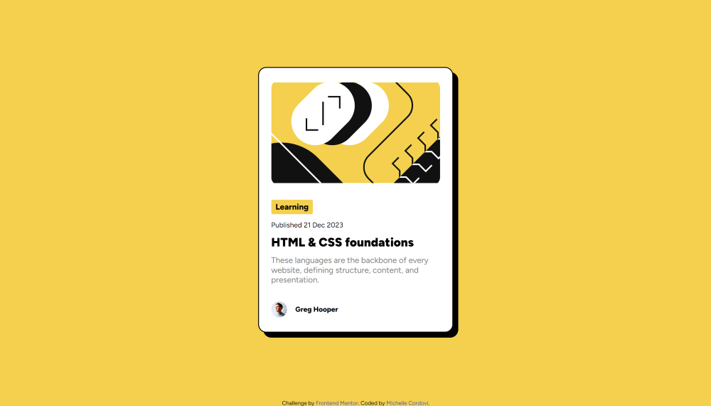
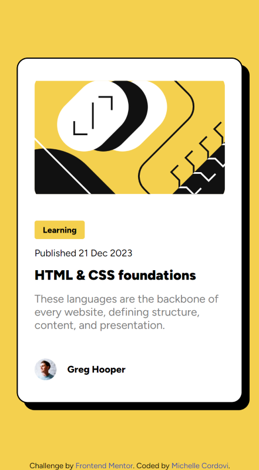

# Frontend Mentor - Blog preview card solution

This is a solution to the [Blog preview card challenge on Frontend Mentor](https://www.frontendmentor.io/challenges/blog-preview-card-ckPaj01IcS). Frontend Mentor challenges help you improve your coding skills by building realistic projects. 

## Table of contents

- [Overview](#overview)
  - [The challenge](#the-challenge)
  - [Screenshot](#screenshot)
  - [Links](#links)
- [My process](#my-process)
  - [Built with](#built-with)
  - [What I learned](#what-i-learned)
- [Author](#author)

## Overview

### The challenge

Users should be able to:

- See hover and focus states for all interactive elements on the page

### Screenshot

### Links

- Solution URL: [Add solution URL here](https://your-solution-url.com)
- Live Site URL: [Add live site URL here](https://your-live-site-url.com)

## My process

### Built with

- HTML5
- CSS
- Flexbox
- Grid

### What I learned

Since this was a simple project, I really used this as an opportunity to really become familiar with Figma. Since I took the time to become more familiar with Figma and its designs, I believe this is one of my most accurate projects for Frontend Mentor to date!

## Author

- Website - [My GitHub](https://github.com/michellecordovi)
- Frontend Mentor - [@michellecordovi](https://www.frontendmentor.io/profile/michellecordovi)
- [My LinkedIn](https://www.linkedin.com/in/michelle-cordovi-pt-dpt-35588683/)

